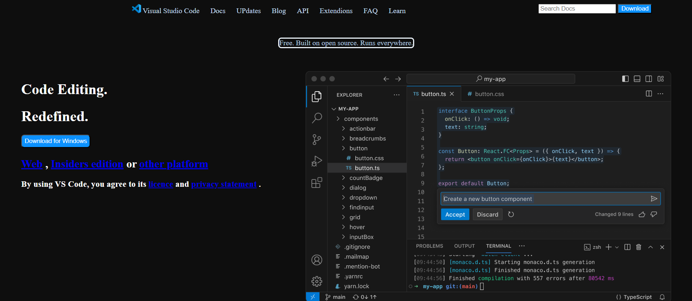

# VS Code Clone

This repository contains a Visual Studio Code Clone project that replicates the design and basic functionality of the popular VS Code editor. It provides a user-friendly interface for code editing with a modern look and feel.

## Features

- **Code Editing Interface:** Replicates the structure and layout of VS Code.
- **Folder and File Management:** Supports a file explorer with folder and file display.
- **Code Syntax Highlighting:** Displays code with syntax-specific styles.
- **Cross-Platform:** Designed to work seamlessly on different devices.

## Screenshot



## Technologies Used

- **Frontend:** HTML, CSS, JavaScript
- **Backend:** Node.js (optional, if required for added functionality)
- **Editor Features:** CodeMirror or Monaco Editor for syntax highlighting and editing.

## How to Run the Project

1. Clone the repository:
   ```bash
   git clone https://github.com/mohitshekhawat1/vs-code-clone.git
   ```

2. Navigate to the project directory:
   ```bash
   cd vs-code-clone
   ```

3. Open the `index.html` file in your browser:
   ```bash
   open index.html
   ```
   Alternatively, you can use a live server to run the project:
   ```bash
   npx live-server
   ```

## Future Enhancements

- Implement file editing and saving functionality.
- Add themes for the editor interface.
- Integrate support for extensions and plugins.
- Include a terminal panel for command-line usage.

## Contributing

Contributions are welcome! Please follow these steps:

1. Fork the repository.
2. Create a new branch:
   ```bash
   git checkout -b feature-name
   ```
3. Commit your changes:
   ```bash
   git commit -m "Add your message here"
   ```
4. Push to the branch:
   ```bash
   git push origin feature-name
   ```
5. Open a Pull Request.


## Acknowledgments

- Inspiration: Visual Studio Code
- Icons and Fonts: Font Awesome, Google Fonts
